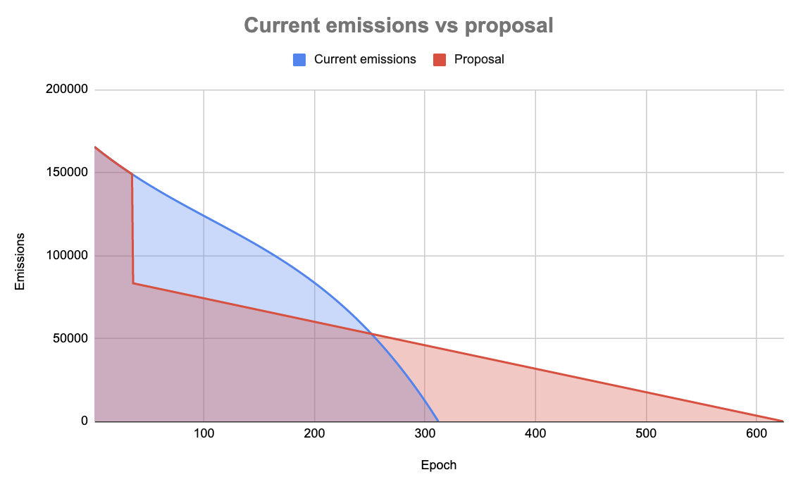
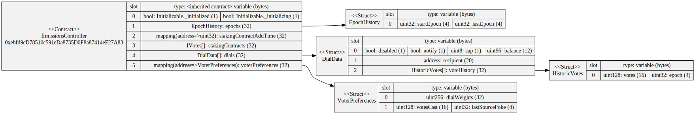

## Summary

It is proposed to reduce the emissions of the Emissions Controller from the specified in the [MIP 24](../MIPS/mip-24) to a simple linear function, extending the emissions schedule from 6 years to 12. The goal of this proposal is to decrease weekly emissions and therefore reduce the selling pressure of MTA.

## Abstract

The Emissions Controller distributes an amount of MTA per week, according to what Stakers vote using dials. The amount of MTA to be distributed per week is a result of a polynomial function (specified in [MIP 24](../MIPS/mip-24)), which ends up distributing 30M MTA throughout 6 years.

As was discussed in this [forum post](https://forum.mstable.org/t/rfc-disable-all-dials-except-staking-treasury-and-create-a-v2-incentives-one/894),  emissions are currently a problem for MTA holders because they are going to farmers that provide liquidity and sell their rewards to improve their yield, instead of increasing decentralisation. Therefore the emissions are not used in the intended way.

This proposal suggests updating the emissions controller and reducing overall weekly emissions by 45%, changing the emissions curve to a linear function and extending emissions of the same amount over 6 more years.

## Motivation

Liquidity mining programs have proven to be ineffective for achieving long-term, sustainable growth, resulting in a loss of liquidity when they are ended and a lower token price due to liquidity providers selling the reward token to increase their yield. At the same time, the market conditions have changed, and many protocols are ending these programs. This proposal aims to protect MTA holders’ capital and Treasury by reducing the overall weekly emissions.

## Specification

**MTA emission schedule**

It is proposed to change the distribution of the remaining 24.5 Million MTA over 12 years instead of 6, starting from 25th August 2022 (which is epoch 37) and ending on 24th November 2033 (epoch 612). 

The weekly distribution schedule of the 24.5 Million MTA is defined by the following linear equation:

f(x) = -Ax + B

with 

A = 141,142,065,475,643

B = 88,072,648,856,801,500

x = epoch.

This will quickly reduce the amount of MTA being distributed each week in order to end at 0 by the last epoch, reducing instantly the emissions by ~45%. If for any reason the implementation of this was delayed one or two weeks, the parameters in the linear function would be adjusted to maintain these two characteristics: (i) the last epoch, the MTA to be distributed shall be 0 and (ii) there shall be 612 epochs of distribution (12 years). This can be seen in the following chart:

## Technical Specification

The Emissions Controller contract on Ethereum mainnet follows the proxy upgradable pattern with the following address: [0xBa69e6FC7Df49a3b75b565068Fb91ff2d9d91780](https://etherscan.io/address/0xBa69e6FC7Df49a3b75b565068Fb91ff2d9d91780#readProxyContract)

The current implementation of the Emissions Controller on Ethereum mainnet is deployed to the following address: [0xebfd9cd78510c591eda8735d0f8a87414ef27a83](https://etherscan.io/address/0xebfd9cd78510c591eda8735d0f8a87414ef27a83#code).

A new implementation contract of the `EmissionsController.sol` will be deployed with the following constructor arguments:

An Instance of the `EmissionsController.sol` will be deployed with the following constructor arguments:

- `nexus = 0xAFcE80b19A8cE13DEc0739a1aaB7A028d6845Eb3` (Nexus Contract)
- `rewardToken = 0xa3BeD4E1c75D00fa6f4E5E6922DB7261B5E9AcD2` (MTA Token)
- `TopLevelConfig = { A: 141142065475643, B: 88072648856801500, C: 0, D: 0, EPOCHS: 612 }`

A and B are used for the new linear distribution schedule. C and D are no longer in use but have to be defined in order to match the storage pattern of the proxy contract.

The `EmissionsController.sol` will be updated in the following way:

- `function topLineEmission(uint32 epoch) public view returns (uint256 emissionForEpoch)` change to a linear emission function as specified above.

The new implementation contract should remove the `initialize` function as the proxy has already has the storage data. The `EmissionsController` still needs to implement `Initializable` to preserve the storage slots in the proxy contract.

## Copyright

Copyright and related rights waived via [CC0](https://creativecommons.org/publicdomain/zero/1.0/).