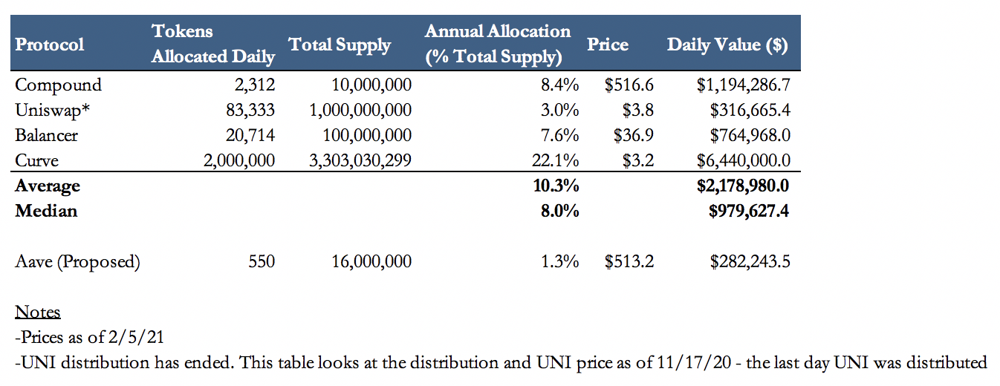

<!--You can leave these HTML comments in your merged MCCP and delete the visible duplicate text guides, they will not appear and may be helpful to refer to if you edit it again. This is the suggested template for new MCCPs. Note that an MCCP number will be assigned by an editor. When opening a pull request to submit your MCCP, please use an abbreviated title in the filename, `mccp-draft_title_abbrev.md`. The title should be 44 characters or less.-->

## Simple Summary

<!--"If you can't explain it simply, you don't understand it well enough." Provide a simplified and layman-accessible explanation of the MCCP.-->

_Note: This MCCP assumes a positive resolution to [MIP-9](../MIPS/mip-9)._  
_Note: This MCCP does not propose changes to the MTA assigned to Staking rewards_

It has long been proposed that major optimisations can be made to the MTA emission. This MCCP proposes a major revamp; bringing all the incentives "in-house" to create better circular effects, reduce MTA sell pressure and maximise TVL. This proposal also outlines a prospective emission schedule over the next few years, and a set of rules to follow in order to calculate weekly distributions.

## Abstract

<!--A short (~200 word) description of the variable change proposed.-->

The MCCP proposes that mStable:

**a)** stop incentivising **mAsset** liquidity on third party protocols and focus entirely on Feeder Pools (e.g. tBTC/mBTC feeder pool, which has an effect of leveraging **&** giving more fees to mAsset SAVE)

**b)** change the rewards contracts so that X% of MTA is unlocked immediately and Y% is vested over Z months (like the current imUSD vault), with a boost for being an MTA staker, thus incentivising LPs over a longer time period

**c)** stick to the outlined emission schedule (over the next 16 weeks) and ruleset defined here in order to calculate weekly pool distributions

## Motivation

<!--The motivation is critical for MCCPs that want to update variables within mStable. It should clearly explain why the existing variable is not incentive aligned. MCCP submissions without sufficient motivation may be rejected outright.-->

The current incentives structure is inefficient and does not promote long term project alignment. LP's are rewarded for providing mAsset liquidity on to third party platforms, which, while providing some utility for mAssets, does not induce circular effects in mStable, and benefits the third parties moreso. In addition, LP's are only incentivised over a very short time period as the rewards unlock immediately, thus incentivising 'flash' liquidity provision and short term outlook on MTA. Thirdly, the calculation of quantities and determination of which sources should receive MTA emission is inefficient and could be optimised with a ruleset.

This MCCP interacts positively with [MIP-8](../MIPS/mip-8) and has the power to set the tokenomics on a different course: increasing mStable TVL, increasing fees to mAsset SAVE, increasing revenue to buy & make, reducing sell pressure for MTA and causing people to be MTA bulls due to the lockup and the rewards gained from being a staker.

Goals of MCCP-4:

- Utilise MTA to generate circular effects for mStable
  - Increase net fees going in to mAsset SAVE
  - Leverage utilisation rate for mAsset SAVE
  - Increase revenue allocated to Buy&Make
- Maximise mAsset TVL
- Maximise demand for MTA
  - Reduce sell pressure for MTA

It is worth reflecting upon emissions from comparative projects - see fig below taken from [Aave's forum](https://governance.aave.com/t/proposal-introduce-liquidity-incentives-for-aave-v2/2340). All 4 of these projects rewarded liquidity to their own pools, rather than external platforms.



## Specification

### 16 week emission

There are ~43m MTA remaining in the rewards pool for distribution. The idea is that this emission would be front loaded and last for ~5-6 years, finishing in April 2027. It is assumed that MTA's value would increase over time as reward units drop. The monthly emission would ramp up over 3 months, from the current emission up to the peak monthly emission of 1.228m MTA per month. It would then ramp down until finishing in 2027.

Proposal: Put this emission into effect for the following 16 weeks, in line with the top line emission schedule, to stimulate growth of mAssets and Feeder Pools, as shown below:


_This equates to an average yearly emission of (52/16)\*3685714 = 12m_

### Ruleset for pool distribution

We define a simple heuristic which will be used to allocate emissions to feeder pools. The allocations for each imAsset vaults and feeder pools are derived from a total MTA emission amount. We denote the rewards received by the imAsset vaults and related feeder pools with `total_emission`. A fixed percentage of `total_emission` denoted by `feeder_emission_pct` goes to the feeder pools, and the rest is rewarded to the imAsset vaults.

```python
feeder_emission = total_emission * feeder_emission_pct
vault_emission = total_emission * (1 - feeder_emission_pct)
```

The emission internally between pools are distributed according to their performance in the previous week. However, before we look into performance, a fixed percentage `base_emission_pct` of emission to feeder pools is distributed equally to the mAsset's feeder pools. In other words, each feeder pools receive a base reward of

```python
feeder_base_emission = feeder_emission * base_feeder_emission_pct / n # MTA
vault_base_emission = vault_emission * base_vault_emission_pct / m # MTA
```

where `n` is the number of feeder pools and `m` is number of mAsset vaults.

On top of base rewards, each pool receives bonus rewards based on their performance from the previous week. We derive a simple performance metric from the volume and liquidity of the pool, according to

```python
# For each feeder pool i
bonus_feeder_factor[i] = volume[i] / liquidity[i]**(1/4)
bonus_vault_factor[i] = volume[i] / liquidity[i]**(1/4)
```

where `volume` is the value of the sum of all trades that were executed by the pool in the past week, and `liquidity` is the value of the time weighted average of total liquidity in the feeder pool in the past week.

Pools receive rest of the rewards proportional to their bonus factors:

```python
bonus_feeder_emission[i] = feeder_emission * (1 - base_feeder_emission_pct) \
        * bonus_feeder_factor[i] / sum(bonus_feeder_factor)
bonus_vault_emission[i] = vault_emission * (1 - base_vault_emission_pct) \
        * bonus_vault_factor[i] / sum(bonus_vault_factor)
```

Finally, the total emission a feeder pool receives is computed as the sum of the base emission and bonus emission

```python
total_feeder_emission[i] = feeder_base_emission + bonus_feeder_emission[i]
total_vault_emission[i] = vault_base_emission + bonus_vault_emission[i]
```

It is proposed that:

- `feeder_emission_pct` = 0.8
- `base_feeder_emission_pct` = 0.2
- `base_vault_emission_pct` = 0.5

Example week 1 numbers, based on emission above of 141758 per week.
Assuming 2 imAsset vaults, 4 fPools, 20% Daily LUR on each pool and ~40k going to MTA sources.

Example week 14 numbers, based on emission above of 283516 per week.
Assuming 3 imAsset vaults, 8 fPools, 20% Daily LUR on each pool and ~40k going to MTA sources.

| Pool allocations   | Current | Proposed (Week 1) | Proposed (Week 14) |
| ------------------ | ------- | ----------------- | ------------------ |
| mBTC/ETH Sushiswap | 15000   | 0                 | 0                  |
| mUSD/WETH Balancer | 23750   | 0                 | 0                  |
| mUSD Curve         | 13750   | 0                 | 0                  |
| imBTC Vault        | 0       | 10175.8           | 16234.4            |
| imUSD Vault        | 12000   | 10175.8           | 16234.4            |
| imXXX Vault        | 12000   | 0                 | 16234.4            |
| fPool 1            | 0       | 20351.6           | 24351.6            |
| fPool 2            | 0       | 20351.6           | 24351.6            |
| fPool 3            | 0       | 20351.6           | 24351.6            |
| fPool 4            | 0       | 20351.6           | 24351.6            |
| fPool 5            | 0       | 0                 | 24351.6            |
| fPool 6            | 0       | 0                 | 24351.6            |
| fPool 7            | 0       | 0                 | 24351.6            |
| fPool 8            | 0       | 0                 | 24351.6            |
| **TOT mAssets**    | 64500   | 101758            | 243516             |

Assuming \$2.3 MTA:  
_Projected TVL Week 1: >121m giving each pool >=10% APY from only MTA rewards_
_Projected TVL Week 14: >291m giving each pool >=10% APY from only MTA rewards_

Assuming \$5 MTA:  
_Projected TVL Week 1: >263m giving each pool >=10% APY from only MTA rewards_
_Projected TVL Week 14: >632m giving each pool >=10% APY from only MTA rewards_

### Rewards contract specification

Each rewards pool will have the following traits:

- 33% of rewards will unlock immediately
- 67% of rewards will be locked for 6 months
- MTA Stakers will receive a boost of up to 4x

Boost calculated with the following formula:

`boost = min(1 + c * vMTA_balance / (s*p)^(7/8), 4)`

Variables:

- \\(c\\): Coefficient
- \\(s\\): LP tokens staked
- \\(p\\): Price coefficient

### Buy & Make + Governance Fees

As pools mature, it is proposed that the % of system revenue streamed to Buy and Make be increased via a following MCCP. Additionally, the governance fee in each Feeder Pool should be activated with the funds being directed towards the active Buy & Make pool.

## Copyright

Copyright and related rights waived via [CC0](https://creativecommons.org/publicdomain/zero/1.0/).
