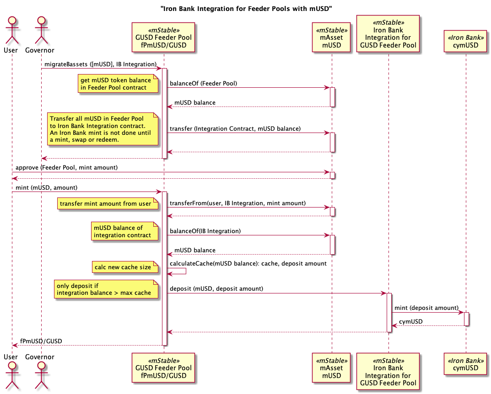
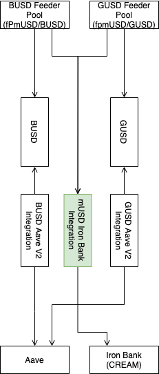

## Simple Summary

This proposal aims to increase the capital efficiency of mUSD in the Feeder Pools by depositing it into the [Iron Bank](https://app.cream.finance/markets/ironbank/mUSD). The Iron Bank is a unique lending protocol developed by [C.R.E.A.M. Finance](https://cream.finance/) that allows collateral-free protocol-to-protocol lending. Once deposited, the mUSD could be further utilized by other protocols and increase the APY of the Feeder Pools.

## Abstract

Feeder Pools have been introduced with [MIP-9](https://mips.mstable.org/MIPS/mip-9.html). This proposal seeks to increase the utilization of these Pools by depositing the available amount in the Iron Bank. The available amount that can be deposited into the Iron Bank is the total amount of deposited mUSD minus the `cache size`(as outlined in [MIP-9](https://mips.mstable.org/MIPS/mip-9.html) Section: Configurable Values). This allows enough mUSD to remain available for offering gas efficient swaps. At the time of writing, the `cache size` is set to 10%, but can be further adjusted with future MCCPs.

## Motivation

In an earlier forum post [Capital Efficiency in mStable](https://forum.mstable.org/t/capital-efficiency-in-mstable/433/3) it was discussed – and agreed upon by the community – that there’s an opportunity to make mStable more capital efficient by depositing idle assets. At the same time, the utilization of the mUSD in the Feeder Pools is rather low, allowing for an opportunity to use the capital elsewhere. This use-case is defined in this Proposal.

This proposal aims to increase the capital efficiency of mUSD that is deposited in Feeder Pools and increase the APY of the Feeder Pools. This can be achieved by depositing mUSD that is deposited in the Feeder Pools into the Iron Bank, allowing other protocols to borrow it, and earning an additional interest.

The Iron Bank is a unique lending protocol developed by C.R.E.A.M. Finance that allows collateral free protocol-to-protocol lending. Smart contract security is an important consideration when it comes to cross-protocol integrations and C.R.E.A.M. Finance provides multiple sources to confirm its security: [Trail of Bits Audit 1](https://github.com/CreamFi/compound-protocol/blob/master/audits/trailofbits-CREAMSummary.pdf), [83% DeFi Safety Score](https://docs.defisafety.com/finished-reviews/c.r.e.a.m-finance-pq-review#code-and-team), [$1.5M bug bounty](https://medium.com/cream-finance/security-immunefi-armorfi-defisafety-aa6e9e7c50e8), and code peer-reviewed by the Yearn team. Additionally, no contract from C.R.E.A.M. Finance has ever been compromised and no users’ funds have been ever been lost.

Overall the return upon implementation warrants the relatively low risk. Not only does it potentially increases the APY for deposits in the Feeder Pools, but it is also a unique opportunity to enhance mStable's position in the ecosystem, adding use-cases for mAssets outside of mStable, and setting positive precedence for mutually beneficial cooperation with third-party protocols.

## Specification

For this integration the existing contract `CompoundInegration.sol` can be reused as Iron Bank has the same interface as Compound. A new instance will be deployed and initiated for each Feeder Pool with the following steps:

1. Deploy `CompoundInegration.sol`
2. Call the contract function `migrateBassets([mUsdAddress], newIntegrationAddress)` to transfer all mUSD in the Feeder Pool to the new integration contract.

Subsequent mint, swap or redeem transactions to the Feeder Pool will deposit the migrated mUSD to the Iron Bank.

For a more detailed contract interaction flow see figure 1 and for contract dependencies see figure 2.

## Copyright

Copyright and related rights waived via [CC0](https://creativecommons.org/publicdomain/zero/1.0/).
