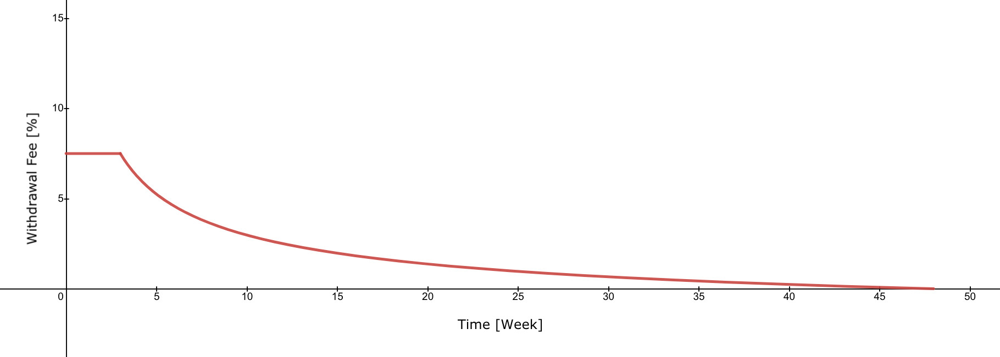

## Simple Summary

It is proposed to overhaul the MTA staking mechanism with an updated release: Staking v2.

Since mStable's inception, MTA staking was a core part of the protocol that allows MTA stakers to govern the mStable protocol and earn rewards. The initial staking duration was set to expire on the 1632580257 (Unix timestamp) ~25th September 2021. With this expiration, a new overhauled staking mechanism is proposed to improve upon the lessons learned from the first iteration. Additionally, this is an opportunity to create a more immersive staking experience. Core concepts are delegation, gamified governance, scaled voting and earning power, and a cooldown with an unstaking window for withdrawals to support usage of the collateral in recollateralisation.

The staked token is a non-transferable ERC20 token. Stakers can choose to stake MTA or 80/20 MTA/ETH Balancer Pool tokens.

## Abstract

Since the inception of mStable, MTA staking was at the very core of the protocol. It allows the community to govern mStable itself, earn rewards and potentially earn a share of the revenue in the future. Part of the emission of MTA goes to stakers to incentivise staking and governance participation. The first iteration of the staking contract was successful with the goal that a big portion of the MTA was locked into the staking contract.

However, as the current maximum staking duration expires at 1632580257 (Unix timestamp), a new iteration of that contract is opportune and would allow improving certain aspects detailed in this proposal. These are based on lessons learned from the first staking contract. Additionally, new concepts can be integrated into the staking contract, which would allow for mechanisms to make staking more fun, engaging and reward participation in a unique way.

The core concepts are delegation, scaled voting and earning power, and a timelock with a cooldown period for unstaking. In addition, a new token contract would allow for more interactive governance participation and open up a whole new venue of gamified governance. These and other contract designs are specified in this proposal. Stakers can choose MTA or 80/20 MTA/ETH Balancer Pool tokens. The staked token itself is a non-transferable ERC20 token

This proposal seeks to improve the staking and community experience and increase value for stakers in the long term, fostering a dedicated community around mStable on the way to increasing decentralisation with increased participation that is rewarded. Furthermore, this proposal opens up the possibilities to integrate a gauges system for reward distribution that is planned for an upcoming release.

## Motivation

The option to extend the maximum lockup with the current iteration of the staking contract was considered, but an overhaul of the staking mechanisms was deemed as the better choice since it allows to evaluate the design of the previous staking solution and improve the staking experience with this release. This release addresses the following lessons that were learned from the previous staking contract:

### Slow and time-intensive governance process

Every change in the protocol and every use of the treasury requires all staked MTA holders to participate in governance. No matter how important, big or small that change is. This requires staked MTA holders to actively participate in the votes on a regular basis. However, not every staker is staying up to date with the latest proposals in mStable. Nor is every staker an active governor and community member that engages regularly in governance discussions. To allow maximum participation rates and to give every staker the chance to inform themselves about the proposal, each vote had to be available for an extended period of time. This had the result to slow down the governance process while not significantly improving participation rates.

Governance votes that require a quick resolution are being avoided due to this slow self-imposed process. Despite the length of the votes to allow for all stakers to participate, voter fatigue is prominent and vote participation gradually decreased over time.

### Voter fatigue

At the very early stage of mStable, governance participation rates were acceptable. Over time, these rates decreased further and further as more proposals were needed to pass governance. At the current state, only around 30-50 voters out of more than 800 actively participate in the votes (4-6%). This shows that the majority of MTA stakers are passive investors and don't seek to participate in day-to-day or week-to-week governance. On the flip-side, there are also very active community members and stakers who are participating in most of the votes and engage in discussions in the forum and on discord very actively. Staking v1 made no distinction between these two different user groups. Furthermore, no quorum thresholds for voting results could be established, since the participation rate is low and a meaningful quorum would require that the majority of MTA participate and back a proposal.

### Complicated user-facing calculations

A key aspect of the old staking mechanism is the decay of voting Power and earning Power (vMTA and pMTA). Both decrease over time. This decay resulted in confusing reward and boost calculations that are not easy to understand and discouraging for new stakers. A boost calculation was supported by the UI for an estimate of the necessary vMTA to receive a certain boost; however, as the vMTA decayed the user needed to adjust the staked amount i.e. increase staked MTA continuously requiring on-chain transactions that can be very costly at times. This caused many incidents in which the users had trouble conceptualizing this mechanism and requiring further assistance in the mStable support channels. A more intuitive mechanism would improve the staking experience for users and evoke a sense of reward rather than discouraging participation due to the decaying of voting and earning power.

## The new approach

To mitigate the previously outlined issues, core concepts of this proposed updated staking contract are

- delegation for mitigating voter fatigue, while engaging active participants
- delegation for the possibility to design more effective governance systems
- static balance with multipliers instead of decaying voting power
- lock up of MTA or 80/20 MTA/ETH Balancer Pool tokens with cooldown and unstake window
- gamified governance with quests that allow earning multipliers to increase voting power and earning power

This new staking release is detailed in the next sections in more detail.

### Delegation

Delegation is commonly defined as the shifting of authority and responsibility for particular functions, tasks or decisions from one person to another. In our case, we want governance votes to shift from passive stakers to active governors. Currently, any staker that does not vote, receives no representation either. The result is that the majority of the vMTA is not used for governance and therefore has no voice.

With this proposal, the delegation would enable a representation for MTA stakers that do not have time or capacity to actively engage in governance. The delegator could shift their voting power to a trusted community member or governor. It would shift the focus away from voting with raw token power and add the element of reputation into the staking mechanism. A delegatee on the other hand that has voting power delegated to, would act on behalf of their delegates and needs to weigh every decision for voting in the light of the broader picture. A delegatee that misbehaves and does not act in the best interest of the delegator, would lose voting power to one delegatee that is more aligned with the interest of the delegator, due to gaining a bad reputation that would shift delegation away to another delegatee. This mechanism allows for a higher participation rate of the staked MTA and a fair representation for all stakers, regardless of time commitment or amount of MTA.

Active members are devoting more time to the governance process, make more informed decisions on what is best for mStable and the ecosystem. This should make governance more meaningful since more of the staked MTA is used for voting. As a next future step, Quorums could be defined to further legitimise proposals with high stakes.

### Governance that rewards participation

A core concept of DeFi is decentralisation. This necessitates a governance model that allows every holder of MTA to contribute and participate in governance if they choose so. DeFi governance models were mostly influenced by real-life governance processes, this being a representative or direct democracy, and are yet to explore new mechanics that the technology uniquely enables. Smaller stakers that own a relatively small amount are not encouraged in participating, since their share of votes is low and in absence of other incentives are not regarded as meaningful enough.

DeFi is in a unique position to reinvent governance processes by providing users with mechanisms that go beyond mere voting in governance. A neglected aspect of governance is gamification - allowing users to gain a sense of progress while rewarding participation and full-filling tasks with tangible incentives. These incentives come in the form of multipliers that could be unlocked from fulfilling quests. These quests help mStable to guide and mobilize the staker community by incentivizing them with a particular task while also allowing members to earn higher rewards. This way the community can be a powerful driver with supporting the protocol in a meaningful way other than just governance centric participation, such as promoting posts on Twitter.

### Static and scaled balance with multipliers

The way that participation in governance and other actions can be rewarded is via a proposed scaled balance. This balance would be derived from the staked balance that gets scaled up according to the fulfilment of set requirements. One of these requirements is a time derived multiplier. The longer the user stakes, the higher the multiplier. This is a way of encouraging long-term commitment. A long duration of staking has an increasing potential to earn more and therefore is unlikely to be withdrawn.

The other way to increase participation is quest multipliers. These quests can be anything from voting on proposals to more elaborate tasks. This allows committed and active stakers of the community to be mobilized to help the ecosystem for a given cause. Quest multipliers are verified via signatures from the staker and added to the chain via a trusted signer address that aggregates the signatures from the signers and calls a function on the staking contract to mark these quests as completed on-chain.

Both multipliers increase the voting power and the earning power. This allows to distribute more MTA towards active participants and give them a bigger voice when it comes to governance over the protocol.

## Specification

The new proposed staking contract seeks to address the issues outlined in the previous section and to improve the aforementioned mechanics to create a better staking experience and improved governance processes.

To address those issues, these specifications outline the various mechanics build into the new staking contract.

### Vote Delegation

Before the user commits to staking, the option to delegate their voting power is available. A choice between a minimum of 10 delegates is embedded in the UI to give enough choices for the user. These roles will be filled with prominent community members but are generally open to anyone who would like to actively participate in governance. The delegation is an Implementation of [ERC20VotesUpgradeable](https://github.com/OpenZeppelin/openzeppelin-contracts-upgradeable/blob/f9cdbd7d82d45a614ee98a5dc8c08fb4347d0fea/contracts/token/ERC20/extensions/ERC20VotesUpgradeable.sol) from [OpenZeppelin](https://openzeppelin.com/). The staker can choose to self delegate or delegate to an address at the initial staking operation or any time after the MTA has been locked up. Being able to change a delegation is crucial to avoid the concentration of voting power and to hold delegatees accountable for their votes since failure to participate or malicious participation can be addressed via this change.

### Staking, raw balance, and scaled balance

The staking and locking of MTA are at the very core of this proposal. It opens up the voting and allows a staker to benefit from reward emissions. Upon staking, the user receives either stkMTA (staked MTA or raw staked balance) or staked Balancer Pool tokens. Like in staking v1, this is a non-transferable token and rewards accrue via the same contract. Unlike the staking iteration v1, this staked token does not decay over time and the rewards are not vested for a period of time. The staked amount in MTA becomes the raw balance that can be further increased with multipliers to receive scaled balance \\(b\_{scaled}\\). Hence voting power and earning power is based on the scaled balance after each multiplier is factored in.

The scaled balance \\(b\_{scaled}\\) is calculated as:

\\[
b_{scaled} = b_{raw} * m_{quest} * m_{time}
\\]

with \\(b*{raw}\\) being the raw staked MTA amount, \\(m*{time}\\) the time multiplier based on the length of staked duration (see table below), and \\(m\_{quest}\\) the multiplier for quests.

### Gamified Governance and Quests

Governance should be fun to participate in, interactive and not be limited to proposals or voting alone. Therefore, to incentivise participation and engagement, a quest mechanism is included in this release. The stakers scaled balance is increased with the fulfilment of quests. The multiplier \\(m*{quest}\\) increases a staker's scaled balance \\(b*{scaled}\\) as shown in the equation above.

The multipliers for the quests themselves are summed up and divided into 2 different types; \\(m*{season}\\) for multipliers that are only valid for a limited length of time the so-called season and \\(m*{perm}\\) for multipliers that are added permanently and that don't expire. The length of a season is set to 9 months and the set `questMaster` can start a new season and set the quests from the previous seasons to expire. The `questMaster` is the set address that has permission to add new quests and can control the state of the existing ones. This mechanism would allow the staker to earn a multiplier for a predetermined amount of time with a dampening factor in the form of a new season to allow everyone to start fresh on an equal level at the beginning of a new season.

The overall multiplier for the quests \\(m\_{quest}\\) can be calculated as:

\\[
m_{quest} = \sum{m_{season}}+\sum{m_{perm}}
\\]

The range for multipliers, either \\(m*{season}\\) or \\(m*{perm}\\) can only bet set between \\(1 < m ≤ 1.5\\). The values are to be chosen conservatively, since they can increase the vote and earning power, especially for permanent multipliers. A quest duration cannot be set lower than 1 day but can be set for an extended amount of time.

### Time multiplier

To incentivise long-term staking, a time multiplier \\(m\_{time}\\) is applied. This multiplier is dependent on the length of weeks the MTA remains staked:

| Staking length        | Multiplier |
| --------------------- | :--------: |
| less than 13 Weeks    |     1      |
| 13-25 Weeks           |    1.2     |
| 26-51 Weeks           |    1.3     |
| 52-77 Weeks           |    1.4     |
| 78-103 Weeks          |    1.5     |
| longer than 103 Weeks |    1.6     |

For the staked duration, the `weighedTimestamp` is used. This means that if the staker locks more MTA after the initial staked amount, the `weightedTimestamp` will be recalculated linearly with the relative amount by which the stake increases. The more the user re-stakes, the closer the `weighedTimestamp` approaches the current timestamp.

### Cooldown & unstake window

Redeemers must signal their request for a given amount to withdraw by entering a 3 week cooldown period. This period is followed by an unstaking window of 2 weeks during which the requested balance can be withdrawn. Partial withdrawals are possible. If the unstaking window period expires without the staker initiating the withdrawal, a new cooldown period needs to be initialised. During the cooldown, the **voting** and **earning** power for the amount that was chosen to be withdrawn is removed as the staker has signalled to exit with that amount. If the staker only partially withdraws his stake, voting and earning with the remainder of the locked amount is unaffected.

### Early withdrawal fee

To avoid users withdrawing early and potentially exploiting the governance process with e.g. purchasing MTA for a short-term only, swaying a vote and thus consequently unstaking, an early withdrawal \\(fee\\) is charged based on the following equation:

\\[
\displaylines{
fee =
\begin{cases}
10 & 0 \leq x\leq 2\\
\sqrt{ \frac{300}{x} }-2.5 , & 2 <x< 48\\
0 & x\leq48
\end{cases}
}
\\]

With \\(x\\) as the weeks since the user has staked. For \\(x\\) the `weightedTimestamp` is used, which would affect the staked duration if the staked amount increases. After week 48 the fees would be 0% for all withdrawals. The maximum fee is 10% for staking shorter or equal to 2 weeks. The graph below shows the gradual decay of the fee until it crosses 0% after 48 weeks.

### Recollateralisation Module

Both the cooldown and unstake window and the early withdraw fee act as a backstop to early withdrawals in situations when the protocol experience a stress event. Initially the `collateralisationRatio` is set to 100% and the `slashingPercentage` is set to 0. But this can be changed in the future by governance and the staked MTA could then be used for recollateralisation.

### No wrapper contracts

Only whitelisted contracts can call specific functions within this contract, in particular for staking and unstaking. This is in order to avoid tokenised wrappers that could potentially circumvent the unstaking procedure and create a secondary market for staked MTA. Contract addresses can be whitelisted via MCCP, if governance deems that the intention of the wrapper contract is a net benefit to mStable.

## Technical Specification

### General Overview

At the heart of this new staking module is the contract `StakedToken.sol`. This contract handles staking, unstaking and has the functionality to disable staking before recollateralisation. `StakedTokenBPT.sol` extends this contract for Balancer Pool specific functions, while `StakedTokenMTA.sol` extends the contract with MTA specific functionality.

`GamifiedVotingToken.sol` is a checkpointed Voting Token derived from OpenZeppelin [ERC20VotesUpgradable](https://github.com/OpenZeppelin/openzeppelin-contracts-upgradeable/blob/f9cdbd7d82d45a614ee98a5dc8c08fb4347d0fea/contracts/token/ERC20/extensions/ERC20VotesUpgradeable.sol). It extends a ERC20 token to add the functionality to keep track of delegation and vote delegation via writing checkpoints. These checkpoints get written whenever the delegation changes from the `StakedToken.sol` contract, e.g. when MTA is staked and an address for delegation is specified via `function delegate()` .

`GamifiedToken.sol` is at the root of both contracts and is the non-transferrable ERC20 token. It holds the logic for the Token and manages the Quests and their states. The `modifier questMasterOrGovernor()` specifies that only the Quest-master or the set governor can add new quests. The corresponding smart contract `QuestManager.sol` handles quests management.

### New Library Dependencies

For the tracking of quest completion, `SignatureVerifier.sol` is used. This was first implemented by [Zapper.fi](http://zapper.fi) for their recent gamification feature and checks if a message has been signed by a verified signer via `personal_sign`.

The remaining libraries and interfaces have been used in prior versions and other parts of the mStable protocol.

### StakedToken

The contract `StakedToken.sol` handles staking, unstaking and potential recollateralisation. This contract will be initialised with the following parameters:

- `cooldownSeconds = 1.814e6` (3 Weeks)
- `unstakeWindow = 1.21e6` (2 Weeks)
- `rewardsToken = 0xa3BeD4E1c75D00fa6f4E5E6922DB7261B5E9AcD2` (MTA Deployed Address)
- `stakedToken = 0xa3BeD4E1c75D00fa6f4E5E6922DB7261B5E9AcD2` (MTA Deployed Address)
- `questSigner = 0xfe99964d9677d7dfb66c5ca609b64f710d2808b8` (Managed by ProtocolDAO)
- `nexus = 0xAFcE80b19A8cE13DEc0739a1aaB7A028d6845Eb3` (Nexus contract)

A second instance will be deployed for the 80/20 MTA/ETH Balancer Pool staked contract the same parameters except for `stakedToken` as the address for the 80/20 MTA/ETH Balancer Pool (Pool not deployed yet, address TBD)

These parameter are immutable and therefore not adjustable with an MCCP.

**Modifiers:**

- Recollateralisation module: This contract modifiers for functions that are specific for the recollaterisation module: `modifier onlyRecollateralisationModule()` The Recollateralisation module is not part of this release and will be added in the future.
- Recollateralisation event: In order to prohibit withdrawals and other functionality during a recollateralisation event the `modifier onlyBeforeRecollateralisation()` is added to limit some functionality. This will only be enabled if the collateralisation ratio is below a threshold. This functionality can be added in the future.
- A modifier for the assertion that no other smart contract has called the contract is added: `modifier assertNotContract().` This would allow all EOA (Externally Owned Accounts) to call a specific function, but not third-party smart contracts. Contract addresses can be whitelisted via a governance process (see section Configurable Values).

**Functions:**

- `function stake()` stakes a given amount via transferring to the contract. Variations of this function can be called with an address to delegate to and resetting the `coolDown` timer.
  - If a delegate has been specified, then that address will be recorded. Otherwise the sender of the transaction will be set as the delegatee
  - Recalculates the cooldown period with the new amount or resets it
  - Mints staked tokens and transfers to the sender
- `function withdraw()` withdraws tokens after the elapsed cooldown period but before the unstake window. A redemption fee will be applied that is calculated by the `calcRedemptionFeeRate(balance.weightedTimestamp)`
  - Recalculates the cooldown timer if necessary, or exit the cooldown period
  - Settles the withdrawal by burning the voting tokens and transferring the MTA back
- `function startCooldown()` initiates the cooldown. This function will also update reward and voting power, depending on the amount that is given to the cooldown
- `function endCooldown()` ends the cooldown period and restores the full voting and earning power
- `function calcRedemptionFeeRate()` returns withdrawal fee see calculation in section Early withdrawal fee

**Recollateralisation Event:**

- `function emergencyRecollateralisation()` : This is a function that allows the whitelisted recollateralisation module to slash stakers and use the capital for recollaterilisation. Undercollateralised means that all users must withdraw, and will only receive a proportional amount back relative to the `colRatio`.
- To change the slashing percentage, the `function changeSlashingPercentage()` can be called by a set Governor with a prior MCCP vote.
- To whitelist or to reverse (to blacklist) contract wrappers, the `function whitelistWrapper()` and `function blackListWrapper()` respectively can be called by a set Governor. Such a call would require prior governance approval via MCCP.

### GamifiedVotingToken

This contract mainly has the function to record checkpoints for delegation. The `function _delegate()` is called from within the contract whenever staking occurs. The public `function delegate()` allows for a staker to delegate to a new address. Both of these paths first call `function _afterTokenTransfer()` to either mint, burn, or update the total supply by recording a checkpoint with `function _writeCheckpoint()` and move the voting power with `function _moveVotingPower()` that writes a new checkpoint again.

Other functions that don't change the state, but are important for various calculations of voting power are these getters:

- `function checkpoints()` returns the checkpoint for an `account` with specified `pos`
- `function numCheckpoints()` returns the number of checkpoints for an `account`
- `function delegates()` returns with the given `account` the set delegatee
- `function getVotes()` returns the current vote balance for `account`
- `function getPastVotes()` retrieves the number of votes for `account` at the end of `blockNumber`
- `function getPastTotalSupply()` retrieves the `totalSupply` at the end of `blockNumber`
- `function totalSupply()` returns the total sum of all scaled balances

### GamifiedToken

This contract handles the application of multipliers and mints and burns scaled balances.

**Modifiers:**

- `modifier onlyQuestManager()` limits certain functionality to the set `questManager` smart contract, see section questManager.

**Getters:**

- `function balanceOf()` returns scaled balance for `account`
- `function rawBalanceOf()` returns raw balance (the underlying MTA) for `account`
- `function balanceData()` returns raw balance Data

A key aspect of the new staking contract are quests and the following functionality:

- `function reviewTimestamp()` is called by anyone to poke the timestamp of a given account. This allows users to effectively 'claim' any new `timeMultiplier`, but will revert if there is no change there.
- `function applyQuestMultiplier()` adds the multiplier awarded from quest completion to a users data, taking the opportunity also to check time multipliers. Can only be called from the questManager contract.

### QuestManager

This contract is the center point for quest management and their completion status. Due to the option of different tokens staked, this

**Modifiers:**

- `modifier questMasterOrGovernor()` limits certain functionality to the set `questManager`

**Functions:**

- `function setQuestMaster()` a new `questMaster` can be set with this function. Can only be called by the set Governor or `questMaster`
- `function setQuestSigner()` a new `questSigner` can be set with this function. Can only be called by the set Governor
- `function addStakedToken()` adds a new contract address for a staked token. Can only be called by the set Governor
- `function addQuest()` is called by `questMasters` to add a new quest to the system with default `ACTIVE` status.
- `function expireQuest()` is called by `questMasters` to expire a quest, setting it's status as `EXPIRED`. After which it can no longer be completed.
- `function startNewQuestSeason()` is called by `questMasters` to start a new quest season. After this, all current `seasonMultipliers` will expire. A new season can only begin after 9 months of the previous season have passed.
- `function completeQuests()` is called by anyone to complete one or more quests for a staker. The user must first collect a signed message from the whitelisted `questSigner`. The signatures are created with the function in the library contract `SignatureVerifier.sol`

**Getters:**

- `function getQuest()` returns the raw data for a quest
- `function hasCompleted()` checks if a given user has completed the given quest.

### Additional dependencies and interfaces

`GamifiedTokenStructs.sol` specifies structs, for Balance, QuestType, QuestStatus. Data structures define a collection of variables under a single name.

For the rewards accrual and calculations, the contract `HeadlessStakingRewards.sol` is used. This contract has been used previously in staking LP-Tokens, like the Feeder Pool Tokens and contains no vesting for the earned rewards.

### Configurable Values (Via MCCP)

- Whitelisting/Blacklisting of contracts via the `function whitelistWrapper ()` and `function blackListWrapper()` respectively.
- Change `slashingPercentage` via the `function changeSlashingPercentage()` (initially 0)
- Set a new `questMaster` (initially Questing Committee multisig) via `function setQuestMaster()`
- Set a new `questSigner` (initially Questing Committee multisig) via `function setQuestSigner()`

## Permissions

As outlined with this proposal, there are many configurations and possibilities when it comes to the quest mechanics. Quests are a key part of this new gamified governance release. However, it is not regarded as a critical part of the protocol and is not prone to abuse. To avoid lengthy governance processes and voting for each quest, this proposal further allows the set `questMaster` to add quests, to set quests status to `EXPIRED`, and to start a new season.

Quests will be developed by the Questing Committee and the `questMaster` will be set to the Questing Committee multisig address: `TBD`

Additionally, the set `questSigner` address, which is managed by the ProtocolDAO, gains the permission to collect and aggregate signatures in the front-end for the completion of quests on stakers behalf, thus saving gas for the users.

## Copyright

Copyright and related rights waived via [CC0](https://creativecommons.org/publicdomain/zero/1.0/).
