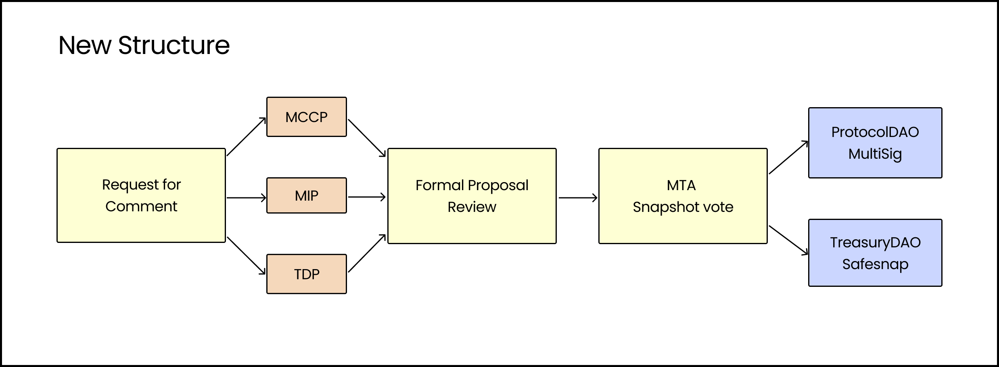

## Simple Summary

It is proposed to overhaul the proposal workflow to accommodate the increased demand in decentralisation and to establish a community first governance principle in which the proposals are open for discussion in the community right from the beginning. This will put the ProtocolDAO and the TreasuryDAO into a position of executing directly on behalf of Meta Governors.

## Abstract

The current workflow for proposals was designed in the early stages of the protocol lifecycle. During that time, the community was small and the protocol was iterating fast. With the growth of the community and with the ongoing demand to decentralise further to avoid risks of single points of failure, an updated workflow is opportune. With a much more established community around mStable, it is time to put a bigger emphasis on governance processes that are community-driven. This proposal seeks to alter the process by which a proposal is passed from inception all the way to implementation.

## Motivation

The community around mStable has grown significantly in the recent past. As the user base grows and mStable matures, so does the need for decentralisation. This is the first step to reduce the control of individuals over DAOs and to allow the community to be more involved.

This proposed structure would not only decentralise mStable further but also pave the way for a completely autonomous protocol in the future. It ensures that all community members have the same right to voice their opinion over proposals and that no proposed changes just appear in front of them without any flexibility to act on their side.

## Specification

The following chart highlights the new proposed structure:

### 1. Request for Comment (RFC)

This is where ideas are first discussed and brought forward via post on the [mStable forum](https://forum.mstable.org/).

- A Request for Comment should be labelled as such with [RFC] at the beginning of the title.
- It should contain the following sections: Summary, Abstract, Motivation, Pros, Cons

### 2. Proposal Draft Submission

A MIP, MCCP or TDP draft needs to be submitted to mStable's [MIPs repository](https://github.com/mstable/MIPs) as a pull request. A proposal number is assigned only after the following requirements are met:

- Prior RFC resolution was approved by the community in a mainly positive manner
- Following the format described in [MIP 1](./mip-1), [MCCP 1](../MCCP/mccp-1) or TDP XX respectively

### 3. Formal Proposal Review

After the proposal receives an MIP, MCCP or TDP number, it can be posted in the forum for the community to review. Details have to be discussed and adjustments to the proposals have to be reflected at this stage. Multiple iterations and adjustments are to be expected.

### 4. MTA Snapshot Vote

A Snapshot vote can be created to allow everyone to vote on the proposal. Snapshots should generally be opened on Monday, and last until Friday. In urgent cases, this timeframe can be reduced, but at least 72 hours is mandatory to give every Meta Governor enough time to vote.

### 5. Multi-sig / Reality Transaction

After successful resolution, the transaction will be queued by either the TreasuryDAO or ProtocolDAO. Alternatively, Zodiac's Reality integration can be used to automate this step. The timing of the transaction is at the discretion of the respective DAO.

## Copyright

Copyright and related rights waived via [CC0](https://creativecommons.org/publicdomain/zero/1.0/).
