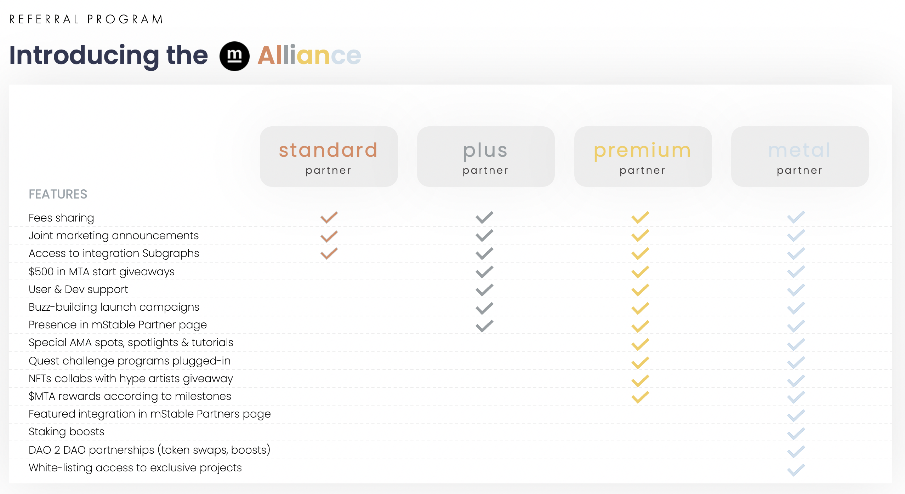

## Simple Summary

In order to foster & reward mStable Save product utilization, it is proposed to launch a B2B Referral Program called the mStable Alliance program.

Rewards would originate from the protocol fees and be then proportionally distributed to partners according to the new liquidity they deposit into Save on a monthly basis. Referrals can be tracked on-chain by adding a referral address in the Save contract

To incentivize even more the program, mStable would offer exclusive rewards to partners

## Abstract

Save can be used to onboard new users from a wide variety of sectors: exchanges, wallets, dApps, CeFi, DAOs. Even though organic synergies between protocols are certainly happening in DeFi, referrals schemes could be highly beneficial initiatives for both parties, fostering mStable products utilization.

B2B partnerships in DeFi make a lot of sense as protocols build on top of each other. They are common measures in CeFi. Referrals rewards provide an economic answer to initial onboarding barriers for integrators and partners.

## Motivation

Save utilization is far from its potential while being one of the safest and highest yielding savings account in DeFi

This program would be an opportunity for partners to become an integrated part of the mStable ecosystem as well as a way to incentivize them and their users to deposit into Save.

## Specification

**a) Contract update**

A `referrer` address can be added to the Save contract to track third-party deposits on Save. The contract would emit an `Event` that can then be used to track and calculate deposits.

**b) Fee origination**

mStable products generate a revenue stream of which a portion goes to savers and the remaining part to the protocol itself. It is proposed to allocate up to 50% of the governance fees to the Alliance Referral Program.

**c) Fee channeling details**

Program rewards will be derived from a % of the government fees and distributed in mUSD / mBTC to partners. The remainder will be handled as usual per the most current proposal (at the time of writing: Buyback & Make)

Distribution in mUSD would remove the risk of partners instantly selling MTA as soon as they receive their rewards. The existing MTA rewards would incentivize partners to deposit imUSD in the vault and get MTA rewards. Doing so would foster their role in mStable governance if they chose to stake those extra rewards

Once per month, payments will be processed towards the referrer's address. Partners can claim them anytime.

**d) Fee sharing rationale**

Partners will be divided into _tiers_ which will determine the percentage of profit shared with them. Tiers would be determined by the Partner Deposited Assets into Save (PDAS) relative to the current total mUSD supply of $120m. The tiers would therefore be expressed in % through their PADS ratio (PADSr)

**Tier repartition**

```
* Tier 1 🥉 – PDAS < $ 500k: 20% of the fees generated
* Tier 2 🥈 $ 500k < PDAS < $ 1m: 30% of the fees generated
* Tier 3 🥇 $ 1m < PDAS < 5m: 40% of the fees generated
* Tier 4 🎖 PDAS > 5m: 50% of the fees generated
```

**e) Deposit tracking & reward calculation**

Each deposit will generate an event easily traceable. Based on each referrer address, mStable will know when someone deposits and compute a 7 days average PDASr at the end of each month. There will be a minimum threshold for executing the fee-sharing transaction of $500.

**Monthly reward formula**

```
$PDAS * (30days Save APY)/12 * % of revenues allocated to B2B * tiers associated sharing fees = X$
```

**f) Introducing exclusive rewards**

The tier categories aforementioned will be further explored with additional rewards given as partnership depth increases and funded

**mStable Alliance tiers**

```
Tier 1 = 🥉  Standard partner
Tier 2 = 🥈 Plus partner
Tier 3 = 🥇 Premium partner
Tier 4* = 🎖 Metal partner

*All current partners get automatically promoted to Tier 3 at the inception of the program, regardless of their PDAS to reward their early Save adoption. This preferential ranking will be revised 6 months after the official launch of the program considering current partners PDAS
```



## Copyright

Copyright and related rights waived via [CC0](https://creativecommons.org/publicdomain/zero/1.0/).
