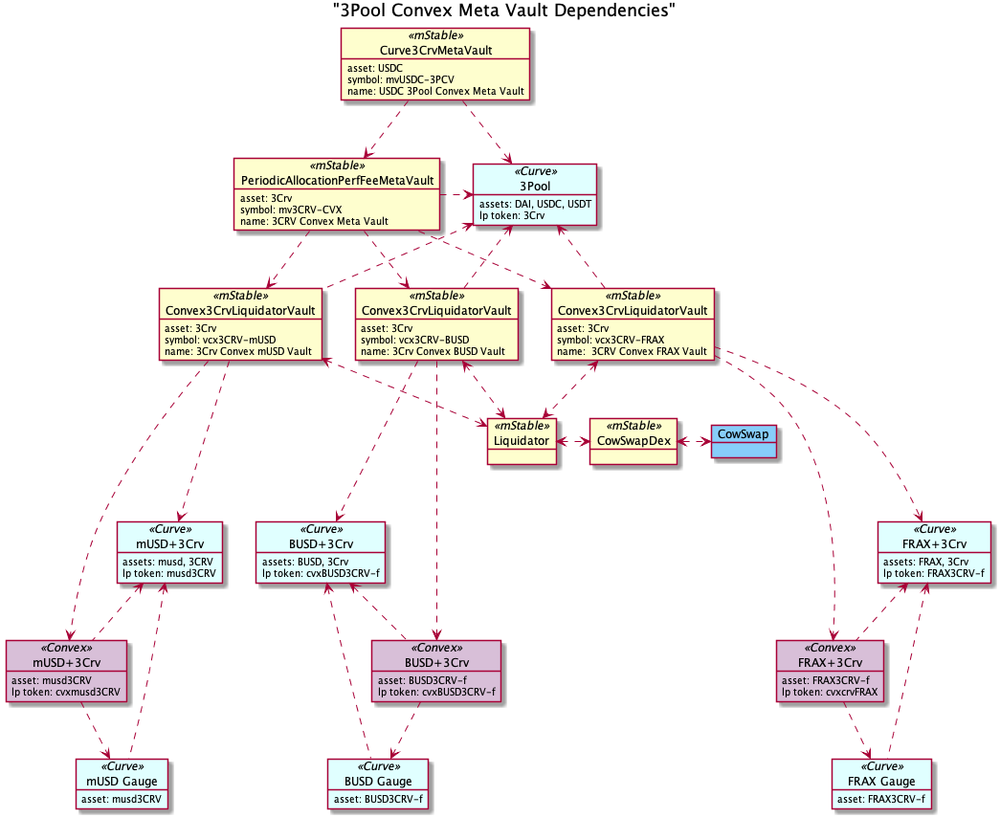

## Simple Summary

It is proposed to deploy and hand over control over the first ERC-4626 Meta Vault contracts to the ProtocolDAO and consequently to the mStableDAO. The first Meta Vault utilizes USDC and invests it in a diversified set of 3Pool-based [Curve](https://curve.fi/) Metapools and stakes it in [Convex](https://www.convexfinance.com/).

## Abstract

The first Meta Vault is prosed to go live on Ethereum mainnet. [Meta Vaults are ERC-4626 compatible contracts](https://medium.com/mstable/erc-4626-meta-vaults-are-coming-to-mstable-9e7c5e182b04) that themselves can use multiple other ERC-4626 contracts in order to earn a yield in a diversified and optimized manner.

The strategy proposed here uses Curve and Convex protocols as yield sources. USDC is the asset to enter and exit the contract. The USDC is then deposited into the [3Pool token](https://curve.fi/3pool), which itself is split up into three Basic Vaults. The Basic Vaults are wrapper contracts around Curve 3Pool Metapools and Convex that enable an ERC-4626 interface. Linked with it is a separate contract that functions by claiming and liquidating the earned rewards in the form of CRV and CVX tokens, and deposits them back into the Basic Vaults to increase the overall value for its depositors. The Meta Vault uses mUSD, BUSD and FRAX as the first set of Metapools assets that are paired with the 3Pool.

This Meta Vault is just the first step towards multiple contracts functioning as the infrastructure for yield. As it is the first application of its kind, complexity to create new sets of strategies should decrease over time. This is enabled by a modular contract structure approach with reusable components.

## Motivation

Yield and DeFi are one of the main use cases that truly gained adoption in blockchain technology, specifically Ethereum. However, yield is not a standardised field. Each protocol and contract can have vastly different interfaces. With the emergence of the [ERC-4626 standard](https://eips.ethereum.org/EIPS/eip-4626), yield products are able to evolve and enable new use cases and functionality that are only possible with a standard. Such new functionality is a generic ERC-4626 compatible Vault that uses any number of other ERC-4626 compatible Vaults as a yield source. This is the Meta Vault that we have been building. With time, Meta Vaults will enable the creation of many diverse strategies by combining different pieces. This first Meta Vault is a step in the direction of a new paradigm in yield infrastructure.

The first application of it is the above-described strategy. This strategy has been proven to retain a moderate yield, semi-independent of market conditions. The combination of Curve and Convex has long been established as the place to earn yield while having a market-neutral perspective or avoiding market volatility by primarily holding stablecoins. However, many DeFi users are not able to gain a profitable yield there without paying a high gas price. And for users that are creating profits, the cost of managing becomes a significant deduction that impacts their yield. Combining this with the effort of diversification compounds this problem even further.

Moreover, yield in DeFi requires active observations and adjustments. For users this can mean that they frequently have to change the yield source to continue earning a yield. Meta Vaults can adapt and adjust the yield source for the users, so the cost of multiple transactions and the time effort spend will be saved and socialised.

Releasing this new Meta Vault will further allow us to continue to innovate on building the infrastructure for upcoming products, and test our components to further optimise them for users.

## Specification

### The Components

At the top level, the USDC asset is deposited into the Meta Vault and then invested in Curve’s 3Pool. The 3Pool LP token (3Crv) is then invested in an underlying 3Pool-based (3Crv) Meta Vault, which is another ERC-4626 vault with Curve’s 3Pool liquidity provider token (3Crv) as an asset.

The 3Crv is invested in underlying multiple Convex 3Crv Basic Vaults based on weights set by the `VaultManager`. Withdraw of assets (3Crv) are first retrieved from the Cache, then from a Vault that is set as the L2 cache, and lastly proportionally withdrawn from the underlying assets. This may not match the weights set by the Vault Manager.

The Basic Vaults are ERC-4626 vaults that deposit Curve 3Pool LP tokens (3Crv) in a Curve 3Pool-based Metapools, eg: musd3Crv - deposits the Metapools LP token in a [Convex](https://www.convexfinance.com/) pool and stakes the Convex LP token, eg cvxmusd3Crv, for CRV and CVX rewards.

The Convex rewards are then swapped for a Curve 3Pool token, e.g.: DAI, USDC or USDT, using the Liquidator module and donated back to the vault. On donation back to the vault, the DAI, USDC or USDT is deposited into the underlying Curve Metapools; the Curve Metapool LP token is deposited into the corresponding Convex pool and the Convex LP token is staked.

The Liquidator module is responsible for collecting reward tokens from the vaults, swapping them and donating the purchased tokens to the vaults. In this strategy, this means collecting CRV and CVX rewards from the Convex 3Crv Basic Vaults and swapping them for DAI, USDC or USDT. The Liquidator then donates the DAI, USDC or USDT back to the Convex 3Crv Basic Vaults.

The following diagram shows the relationship between each contract:

## Technical Specification

This section explains the various roles that can adjust the configuration of the vaults, the various components in more details and their configuration upon deployment.

### Roles

Vaults are managed by two important roles that translate into their related modifiers in the contract:

- **Governor** `onlyGovenor`: This is set to the Governor in our Nexus Contract that is currently set to the ProtocolDAO multisig. Any changes that the governor can make requires a proposal and vote by the mStableDAO. For example, this can be removing an underlying Vault from the Meta Vault, adding an underlying Vault to the Meta Vault, changing fees etc..
- **Vault Manager** `onlyVaultManager`: This role has a limited set of permissions. It cannot remove or add Vaults. It can, however, rebalance between the existing Vaults. This role is setup to allow for agile adjustments of the Vault without putting users’ funds into its control. The Vault Manager role is used by our off-chain components to act upon the recommendations made by the Watchers described in the next section.

### [Curve3CRVMetaVault](https://github.com/mstable/metavaults/tree/develop/contracts/vault/liquidity/curve)

This contract is [ERC-4626](https://eips.ethereum.org/EIPS/eip-4626) compliant and supports all methods described in the specs. This contract will be deployed using the [EIP-1967 Transparent Proxy](https://eips.ethereum.org/EIPS/eip-1967) pattern and requires initialization and can be upgraded with a one week time delay by the `Governor`.

This is the contract that as user can interact by depositing USDC and receiving vault shares. It uses one underlying Meta Vault. In the deposit process the USDC is deposited in the Curve.fi DAI/USDC/USDT `0xbEbc44782C7dB0a1A60Cb6fe97d0b483032FF1C7` 3pool. The $3Crv is then directly deposited to the underlying `metaVault` contract. The implementation of that underlying contract is described next in the `PeriodicAllocationPerfFeeMetaVault` section.

The contract is deployed with the following constructor arguments:

- nexus: `0xAFcE80b19A8cE13DEc0739a1aaB7A028d6845Eb3`
- asset: `0xA0b86991c6218b36c1d19D4a2e9Eb0cE3606eB48`
- metaVault: The underlying Meta Vault address, deployed contract `PeriodicAllocationPerfFeeMetaVault`

And Initialized with the following arguments:

- name: `USDC 3Pool Convex Meta Vault`
- symbol: `mvUSDC-3PCV`
- vaultManager: `0x1116241647D2173342b108e6363fFe58762e3e97`
- slippageData (1% = 100):
  - redeem: `100`
  - deposit: `100`
  - withdraw: `100`
  - mint: `100`

Governor functions:

- Vault operations are pausable by the `Governor`.
- Emergency asset recovery by the `Governor`.
- Vault configuration is controlled by a protocol `Governor`. This includes:
  - Setting the slippage limits for mint, deposit, redeem and withdraw.
- One week time delay for proxy upgrades by the `Governor`.

### [PeriodicAllocationPerfFeeMetaVault](https://github.com/mstable/metavaults/tree/develop/contracts/vault/meta)

This contract is [ERC-4626](https://eips.ethereum.org/EIPS/eip-4626) compliant and supports all methods described in the specs. This contract will be deployed using the [EIP-1967 Transparent Proxy](https://eips.ethereum.org/EIPS/eip-1967) pattern and requires initialization and can be upgraded with a one week time delay by the `Governor`.

The Assets are invested across multiple underlying ERC-4626 vaults of the same asset type. The asset is $3CRV Curve.fi DAI/USDC/USDT `0xbEbc44782C7dB0a1A60Cb6fe97d0b483032FF1C7`. An EOA or another Vault can deposit the asset in order to diversify it throughout multiple `Convex3CRVLiquidatorVaults`. Investment of deposited assets to the underlying vaults is batched in a `settle` process that is initiated by the watcher that has the `VaultManager` role described in the section below. The Vault Manager can also redistribute the assets among the added set of Vaults. Small withdrawals are first covered by the assets that are remaining in the Contract, either those left as Cache or the amount that has not been settled yet. If that cannot be covered, withdrawals are taken from a single configured underlying vault to save gas. Large withdraws are proportionally taken from all underlying vaults and therefore are more expensive in gas. Performance fees are periodically charged on assets per share increases.

- Vault configuration is controlled by a protocol `Governor` which requires a a formal proposal and mStableDAO vote. This includes:
  - Which underlying vaults are used.
  - Which vault small withdrawals are taken from.
  - The threshold for large withdraws as a percentage of shares.
  - Setting the account that receives the performance fee.

The contract is deployed with the following constructor arguments:

- nexus: `0xAFcE80b19A8cE13DEc0739a1aaB7A028d6845Eb3`
- asset: `0xA0b86991c6218b36c1d19D4a2e9Eb0cE3606eB48`

And initialized with the following arguments:

- name: `USDC 3Pool Convex Meta Vault`
- symbol: `mvUSDC-3PCV`
- vaultManager: `0x1116241647D2173342b108e6363fFe58762e3e97`
- performanceFee: `40000` (4%, while 0.01% = 100)
- feeReceiver: [`0x3dd46846eed8D147841AE162C8425c08BD8E1b41`](https://etherscan.io/address/0x3dd46846eed8D147841AE162C8425c08BD8E1b41) (TreasuryDAO)
- underlyingVaults: adresses of added Vaults, see Convex3CRVLiquidatorVault.
- sourceParams: `singleVaultSharesThreshold: 1000, singleSourceVaultIndex 0` (source funds from Vault with index 0 when below threshold).
- assetPerShareUpdateThreshold: [`100000000000000000000000`](https://etherscan.io/unitconverter?wei=100000000000000000000000) (Threshold amount to/from for `assetPerShareUpdate`.

Governor functions:

- Vault operations are pausable by the `Governor`.
- Vault configuration is controlled by a protocol `Governor`. This includes:
  - Which underlying vaults are used.
  - Which vault small withdrawals are taken from.
  - The threshold for large withdraws as a percentage of shares.
  - Setting the account that receives the performance fee.
- One week time delay for proxy upgrades by the `Governor`.

### [Convex3CRVLiquidatorVault](https://github.com/mstable/metavaults/tree/develop/contracts/vault/liquidity/convex)

This contract is [ERC-4626](https://eips.ethereum.org/EIPS/eip-4626) compliant and supports all methods described in the specs. This contract will be deployed using the [EIP-1967 Transparent Proxy](https://eips.ethereum.org/EIPS/eip-1967) pattern and requires initialization and can be upgraded with a one week time delay by the `Governor`.

The asset is $3CRV Curve.fi DAI/USDC/USDT`0xbEbc44782C7dB0a1A60Cb6fe97d0b483032FF1C7` that is then deposited into a single Curve 3Pool based Metapool before depositing the LP token into a Convex pool. Multiple Vaults can be deployed for each Curve 3Pool based Metapool that can then be added to the Meta Vault one level above. The majority of assets are intended to be from the Meta Vault, but at the same time, any contract or EOA can directly invest into any one particular vault.

The functions `deposit`, `mint`, `withdraw` and `redeem` are protected against sandwich attack. The Vault liquidates rewards like CRV and CVX to invest further in 3Crv assets. The Convex rewards are swapped for a Curve 3Pool token, eg DAI, USDC or USDT, using the [Liquidator module](https://github.com/mstable/metavaults/blob/develop/contracts/vault/liquidity/liquidator/README.md) and donated back to the vault. On donation back to the vault, the DAI, USDC or USDT is deposited into the underlying Curve Metapool; the Curve Metapool LP token is deposited into the corresponding Convex pool and the Convex LP token subsequently staked.

These Vaults charge a fee on the liquidated rewards.

- Vault operations are pausable by the `Governor`.
- Emergency asset recovery by the `Governor`.
- Vault configuration is controlled by a protocol `Governor`. This includes:
  - Setting the slippage limits for mint, deposit, redeem and withdraw.
  - Setting the account that receives the liquidation fee.

The contract is deployed with the following constructor arguments:

- nexus: `0xAFcE80b19A8cE13DEc0739a1aaB7A028d6845Eb3`
- asset: `0x6c3F90f043a72FA612cbac8115EE7e52BDe6E490`
- ConstructorData: depending on the Vault, see below.
- streamDuration: `604800` (in seconds)

And initialized with the following arguments:

- name: `USDC 3Pool Convex Meta Vault`
- symbol: `mvUSDC-3PCV`
- vaultManager: `0x1116241647D2173342b108e6363fFe58762e3e97`
- slippageData (1% = 100):
  - redeem: `100`
  - deposit: `100`
  - withdraw: `100`
  - mint: `100`
- rewardTokens: `0xD533a949740bb3306d119CC777fa900bA034cd52 ,0x4e3FBD56CD56c3e72c1403e103b45Db9da5B9D2B`
- donateToken: `0x4e3FBD56CD56c3e72c1403e103b45Db9da5B9D2B`
- feeReceiver: [`0x3dd46846eed8D147841AE162C8425c08BD8E1b41`](https://etherscan.io/address/0x3dd46846eed8D147841AE162C8425c08BD8E1b41) (TreasuryDAO)
- donationFee: `160000` (16%)

Three instances of this contract will be deployed for the following Curve 3Pool based Metapools with different `ContructorData`:

- mUSD:
  - metapool: `0x8474DdbE98F5aA3179B3B3F5942D724aFcdec9f6`
  - booster: `0xF403C135812408BFbE8713b5A23a04b3D48AAE31`
  - convexPoolId: `14`
- BUSD
  - metapool: `0x4807862AA8b2bF68830e4C8dc86D0e9A998e085a`
  - booster: `0xF403C135812408BFbE8713b5A23a04b3D48AAE31`
  - convexPoolId: `43`
- FRAX
  - metapool: `0xd632f22692FaC7611d2AA1C0D552930D43CAEd3B`
  - booster: `0xF403C135812408BFbE8713b5A23a04b3D48AAE31`
  - convexPoolId: `32`

Governor functions:

- Vault operations are pausable by the `Governor`.
- Emergency asset recovery by the `Governor`.
- Vault configuration is controlled by a protocol `Governor`. This includes:
  - Setting the slippage limits for mint, deposit, redeem and withdraw.
  - Setting the account that receives the liquidation fee.
- One week time delay for proxy upgrades by the `Governor`.

### [Liquidator Module](https://github.com/mstable/metavaults/tree/develop/contracts/vault/liquidator)

The Liquidator module is responsible for collecting reward tokens from vaults, swapping them and donating back the purchased tokens to the vaults. Typically, this is swapping reward tokens to vault assets which are then donated back to the vaults to increase their assets per share. For example, swapping $CRV earned in a Curve pool back to a vault asset like $DAI. There can be multiple reward tokens collected from a vault and different target tokens can be specified for each reward token.

The Liquidator's main task is to batch the swapping of rewards collected from multiple vaults. This socializes the gas costs in swapping rewards across multiple vaults.

The Liquidator uses a [Swapper](https://github.com/mstable/metavaults/blob/develop/contracts/vault/swap/README.md) module to do on-chain token swaps. A swapper typically uses a swap aggregator like [1inch](https://1inch.io/) or [Cowswap](https://cow.fi/), but can use decentralized exchanges like [Uniswap](https://uniswap.org/) or [Balancer.](https://balancer.fi/)

### Watchers

The Meta Vault will have four off-chain components that aim to maximise yields, for which we will set up watchers. The watchers will trigger the following actions:

- **Rebalance**: Whenever the Meta Vault is imbalanced, an underlying Curve Metapool has become unbalanced, the Meta Vault became majority owner of the liquidity of a Metapool or the APY has decreased, it will remove funds from a Basic Vault and deposit the remainder into the other pools.
- **assetsPerShare update**: Whenever someone makes a deposit in the Meta Vault, it isn’t automatically deposited in the underlying vaults. Deposits are pooled, and then deposited whenever the function `Settle()` is called. An estimation is needed regarding how many shares the depositor will receive, considering the amount of assets. That is done that by caching `assetsPerShare` of the underlying vaults. The watchers will be actively monitoring it and will trigger an update when `assetsPerShare` increase by 0.0072%
- **Settle**: The watcher will settle after collecting rewards, defining the amounts that will be deposited in each Basic Vault. It’s optimized so that the gas spendings are as little as possible without letting the Meta Vault become heavily imbalanced.
- **collectRewards**: When the gas is low enough, a transaction will be triggered that will collect the CVX and CRV rewards of the underlying vaults and then swap them into USDC, USDT, or DAI.

### Libraries

Additionally, these several libraries contracts are used.

- [Curve3PoolCalculatorLibrary](https://github.com/mstable/metavaults/blob/develop/contracts/peripheral/Curve/Curve3PoolCalculatorLibrary.sol) Calculates Curve token amounts including fees for the Curve.fi 3Pool.
- [Curve3CrvMetapoolCalculatorLibrary](https://github.com/mstable/metavaults/blob/develop/contracts/peripheral/Curve/Curve3CrvMetapoolCalculatorLibrary.sol) Calculates Curve liquidity provider token amounts including fees for 3Crv-based Curve.fi metapools.
- [Curve3CrvFactoryMetapoolCalculatorLibrary](https://github.com/mstable/metavaults/blob/develop/contracts/peripheral/Curve/Curve3CrvFactoryMetapoolCalculatorLibrary.sol) Calculates Curve liquidity provider token amounts including fees for 3Crv-based Curve.fi factory metapools.

## Copyright

Copyright and related rights waived via [CC0](https://creativecommons.org/publicdomain/zero/1.0/).
