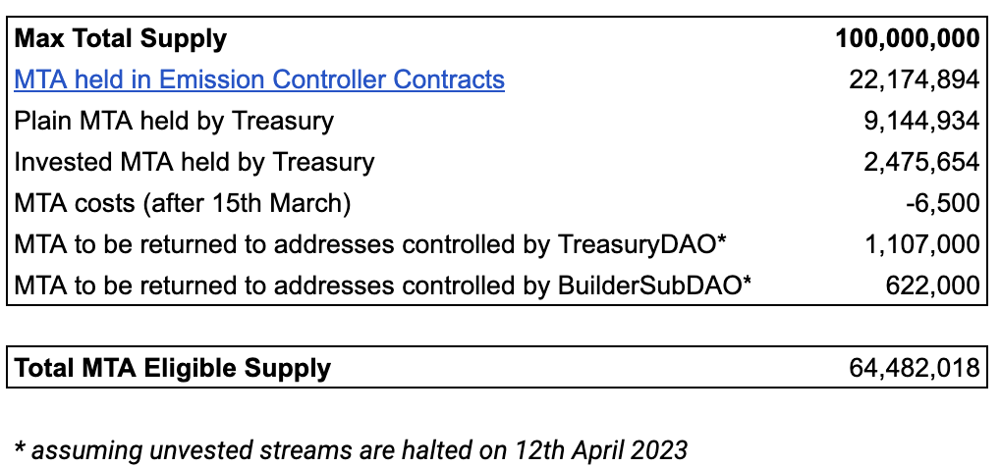
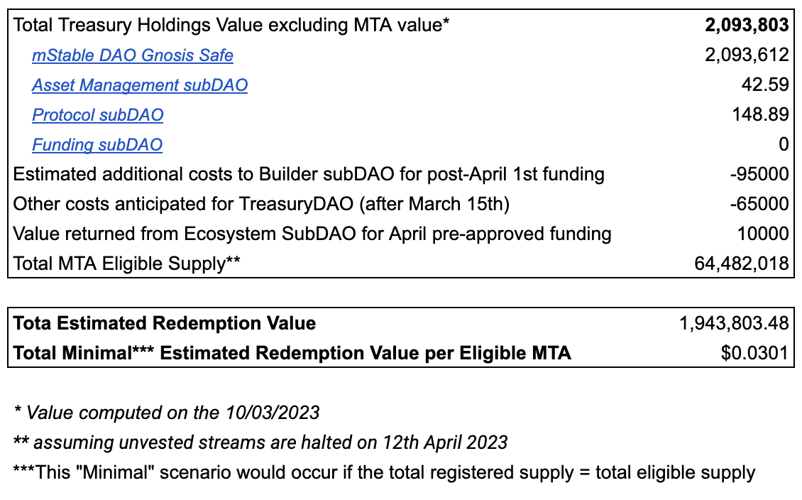

## Simple Summary

It is proposed that the mStableDAO, in the event of a shutdown option being voted on as the path forward for the mStable project, allows MTA holders to register for the redemption of mStableDAO Treasury Assets.

The objective of this MIP is not to discuss whether or not shutting down is the best way moving forward, but what is the fairest and most decentralised way forward for mStable Treasury Assets.

## Abstract

The [MTA token](https://etherscan.io/token/0xa3BeD4E1c75D00fa6f4E5E6922DB7261B5E9AcD2) is an ERC-20 token that can be utilised within the mStable ecosystem.

It has currently two major utilities: primarily, it can be staked in order to enact all governance decisions in the DAO. Secondly, it can be used to incentivise decentralisation and protocol usage through [the emission controller’s dials](https://staking.mstable.org/#/dials). MTA has no rights attached to it beyond these two use cases.

[mStable DAO Treasury Assets](https://zapper.xyz/daos/m-stable) are held across the following 4 addresses:

| Name                    | Address                                                                                                               |
| ----------------------- | --------------------------------------------------------------------------------------------------------------------- |
| mStable DAO Gnosis Safe | [0x3dd46846eed8d147841ae162c8425c08bd8e1b41](https://etherscan.io/address/0x3dd46846eed8d147841ae162c8425c08bd8e1b41) |
| Asset Management subDAO | [0x67905d3e4fec0c85dce68195f66dc8eb32f59179](https://etherscan.io/address/0x67905d3e4fec0c85dce68195f66dc8eb32f59179) |
| Protocol subDAO         | [0xf6ff1f7fceb2ce6d26687eaab5988b445d0b94a2](https://etherscan.io/address/0xf6ff1f7fceb2ce6d26687eaab5988b445d0b94a2) |
| Funding subDAO          | [0xfcf455d6eb48b3289a712c0b3bc3c7ee0b0ee4c6](https://etherscan.io/address/0xfcf455d6eb48b3289a712c0b3bc3c7ee0b0ee4c6) |

Also, as of now, none of the organisations and sub-organisations composing the mStableDAO (MTA stakers) has in their mandate the ability to take action on what could happen to the assets governed by MTA holders in the event of a shutdown or an acquisition.

## Motivation

The motivation underlying this MIP is to ensure a swift, fair and secure way forward for the Treasury Assets governed by my MTA holders in the event of a full project shutdown and the mStable product line being fully sunset as per [MIP 31](./mip-31)

The proposed design of registering for the redemption of the Treasury Assets, during a specific period of 3 months, would make sure only active wallets register to access these funds. It would solve the challenge of dead capital that would otherwise arise in a fixed eligible supply scenario.

Finally, by avoiding dead capital, this proposition proposes MTA holders can redeem value from the Treasury Assets, which would have otherwise become lost.

## Specification

To accurately present mStableDAO Treasury Holdings & MTA circulating supply in order to compute the eligible supply as well as the final redemption value, [this spreadsheet](https://docs.google.com/spreadsheets/d/1uE61fettCPir2cMe3PYhvzkRV6f14-AoMWSCbrz93oA/edit#gid=1492284830) was created. It provides a detailed view of:

- For each of the mStableDAO four wallets, the name, nature of asset held, type of holding (Directly held or deposited in third-party protocol), number of assets held, dollar value of assets
- MTA from core contributor streams to be returned to addresses controlled by the Treasury DAO & Builder SubDAO assuming assuming unvested streams are halted on 12th April 2023
- The value returned from Builder SubDAO & Ecosystem SubDAO for April pre-approved funding

### Estimation of the MTA circulating supply

Eligible supply for redemption: MTA Max Total Supply (100,000,000) would be eligible excluding:

1. Directly held MTA held across the addresses mentioned in the Abstraction section
2. MTA deposited in third-party protocol across the addresses mentioned in the Abstraction section
3. MTA held in the [Emission Controller contract](https://etherscan.io/token/0xa3BeD4E1c75D00fa6f4E5E6922DB7261B5E9AcD2#balances)
4. Unvested core [contributor streams](https://etherscan.io/token/0xa3BeD4E1c75D00fa6f4E5E6922DB7261B5E9AcD2?a=0xa4fc358455febe425536fd1878be67ffdbdec59a)



The formula used to determine the Eligible Supply for Redemption is `Max Total Supply` - `(MTA held in Emission Controller Contracts + Plain MTA held by Treasury + Invested MTA held by Treasury + MTA costs (after 15th March) + MTA to be returned to addresses controlled by TreasuryDAO + MTA to be returned to addresses controlled by BuilderSubDAO)`

Using this formula, the Eligible Supply for Redemption number is 64,482,018 MTA. Details on the calculation can be found on the third tab of this [spreadsheet](https://docs.google.com/spreadsheets/d/1uE61fettCPir2cMe3PYhvzkRV6f14-AoMWSCbrz93oA/edit#gid=1492284830).

### Treasury Value and liquidation

1. Estimation of value redemption

   Using the same Spreadsheet, the current non-MTA value of the Treasury hovers at $2,093,803. It is assumed that there will be a net change in the value of these assets of $160,000 after accounting for funding of the Builder subDAO for April, funding surplus returned from subDAOs and ongoing costs to the TreasuryDAO between now and the end of April. Moreover, it should be clear that the actual price will just be set by the total amount of ETH (see 5.) that ends up being sent to the contract and ETH market value on the day of the swap.
   Hence, the Total Estimated Redemption Value will be close to $1,945,303.48. It will be divided by the total registered MTA during the registering period of 3 months to give each MTA holder their nominal value redemption.
   Using these metrics, the Minimal (A "minimal" scenario would occur if the total registered supply = total eligible supply) Estimated Redemption Value per Eligible MTA would be **$0.0301**

   

2. Nature of redemption: All mStable Treasury DAO Assets would be liquidated for ETH in the coming days after the date of the vote. ETH is the most liquid path to redemption while being a trustless asset

3. After the conversion of the asset to ETH, it will be wrapped into WETH and transferred to the `MetaTokenRedeemer` via function call, as specified in the technical specification section. This will start the registration period for the MTA and will end 3 Months after this event.

### Registered redemption of mStable Treasury Assets against MTA

1. Overview: mStable Treasury holdings would be divided amongst MTA holders in proportion to the total registered MTA.
2. Registering conditions: All MTA from the Eligible Supply (see “Estimation of the MTA circulating supply” section) that is deposited by MTA holders in the `MetaTokenRedeemer` for a period of 3 months, will be considered “registered” for the redemption of mStable DAO Treasury Assets.
3. Method of registering: MTA holders will be able to register their MTA holdings from the LTS app or directly from the smart contract for a period of 3 months. This LTS app is currently being built at the moment by the Builder SubDAO for the Product Shutdown, as per [MIP 31](./mip-31).
4. Method of redemption: After the 3-month registering period, users will be able to redeem their share of the WETH with no expiry. This redemption would happen on the LTS app or directly from the smart contract. A users claim can the be calculated as:
   `WETH_TO_CLAIM = TOTAL_WETH_FUNDED * USER_MTA_REGISTERED / TOTAL_MTA_REGISTERED`
5. This redemption will start 3 Months after the TreausryDAO deposited WETH into the contract.

### Halt Emission Controller’s emissions

The proposal entails the termination of the Emissions Controller contract by updating each dial and disabling their function. The automated tasks will be terminated post last emission. The ProtocolDAO will also not be able to change anything in the contract with the sunset of the Nexus as described in [MIP 31](./mip-31).

### Staking contract

To effectively end governance the cooldown period and unstaking related fees will be removed. This would allow for immediate redemption of all `stkMTA` and `stkBPT`. This can achieved by using the recollateralization functionality and setting the recollateralization module to the ProtocolDAO. Then, triggering a slashing event with the lowest possible amount.

After that, following the sunset of the Nexus contract as described in [MIP 31](./mip-31), the ProtocolDAO would not be able to make any further changes.

The MTA can be withdrawn by Stakers and be used in the proposed redemption.

### Others specifications

- Leave fully vested streams running (as they have already purchased their tokens/provided services for tokens and the delivery is contractually due)
- Given that the mStableDAO and Governance would come to an end after the successful execution of this proposal, the following actions are also proposed:
  - As suggested in [TDP 55](../TDP/tdp-55), TreasuryDAO signer compensation would end once assets are transferred from the Treasury leaving less than $20,000 in asset value custodied by the multisig.
  - It is proposed that the Cat Herder role and compensation should come to an end on the 30th of April, 2023, or 30 days after the resolution of [MIP 30](./mip-30) - whichever is later. The governance coordination role should be minimal after the resolution of [MIP 30](./mip-30) and this timeframe will allow time for winding up governance processes and offboarding.

## Technical Specifications

## Technical Specifications

### Emissions Controller

- Stop emitting MTA to the active dials by the Protocol DAO calling `updateDials` for each of the following dials
  - Emissions Controller [0xBa69e6FC7Df49a3b75b565068Fb91ff2d9d91780](https://etherscan.io/address/0xBa69e6FC7Df49a3b75b565068Fb91ff2d9d91780)
  - Dials
    - MTA Staking: dial 0, disable true, notify true
    - mBPT Staking: dial 1, disable true, notify true
    - imUSD Vault: dial 2, disable true, notify true
    - Polygon imUSD Vault: dial 11, disable true, notify true
    - Treasury DAO, dial 14, disable true, notify true
  - Let the Emissions Controller run the distribution on Thursday for the last time. This includes the following Defender Autotasks
    - \***\*ETH - emissions-controller-01-collect\*\***
    - \***\*ETH - emissions-controller-02-buy-back\*\***
    - \***\*ETH - emissions-controller-04-calculate-rewards\*\***
    - \***\*ETH - emissions-controller-05-distribute-dials\*\***
    - \***\*Polygon - emissions-controller-06-distribute\*\***
  - Pause the previous Emissions Controller Autotasks

### MTA and mBPT Staking

- Protocol DAO proposes the Recollateraliser module in the Nexus is set to the Protocol DAO
  - Nexus [0xafce80b19a8ce13dec0739a1aab7a028d6845eb3](https://etherscan.io/address/0xafce80b19a8ce13dec0739a1aab7a028d6845eb3#writeContract)
  - Nexus function is `proposeModule`
  - Recollateraliser module key is `0x39e3ed1fc335ce346a8cbe3e64dd525cf22b37f1e2104a755e761c3c1eb4734f`
  - Protocol DAO [0xF6FF1F7FCEB2cE6d26687EaaB5988b445d0b94a2](https://app.safe.global/home?safe=eth:0xF6FF1F7FCEB2cE6d26687EaaB5988b445d0b94a2)
- After one week, the proposed Recollateraliser module is accepted by the Protocol DAO
  - Nexus [0xafce80b19a8ce13dec0739a1aab7a028d6845eb3](https://etherscan.io/address/0xafce80b19a8ce13dec0739a1aab7a028d6845eb3#writeContract)
  - Nexus function is `acceptModule`
- Protocol DAO sets the slash percentage on the Staked MTA (stkMTA) contract
  - StakedMTA [0x8f2326316eC696F6d023E37A9931c2b2C177a3D7](https://etherscan.io/address/0x8f2326316eC696F6d023E37A9931c2b2C177a3D7#writeProxyContract)
  - StakedMTA function `changeSlashingPercentage` with the `_newRate` param set to 1
- Protocol DAO starts the emergency recollateralisation on the Staked MTA (stkMTA) contract
  - StakedMTA [0x8f2326316eC696F6d023E37A9931c2b2C177a3D7](https://etherscan.io/address/0x8f2326316eC696F6d023E37A9931c2b2C177a3D7#writeProxyContract)
  - StakedMTA function `emergencyRecollateralisation`
- Protocol DAO sets the slash percentage on the Staked mBPT (stkBPT) contract
  - StakedBPT [0xeFbe22085D9f29863Cfb77EEd16d3cC0D927b011](https://etherscan.io/address/0xeFbe22085D9f29863Cfb77EEd16d3cC0D927b011#writeProxyContract)
  - StakedBPT function `changeSlashingPercentage` with the `_newRate` param set to 1
- Protocol DAO starts the emergency recollateralisation on the Staked mBPT (stkBPT) contract
  - StakedBPT [0xeFbe22085D9f29863Cfb77EEd16d3cC0D927b011](https://etherscan.io/address/0xeFbe22085D9f29863Cfb77EEd16d3cC0D927b011#writeProxyContract)
  - StakedBPT function `emergencyRecollateralisation`

### MTA Redemption contract

A new contract `MetaTokenRedeemer` will be used for the redemption registration, rate calculation and redemption. The contract has the following interface:

```solidity
interface IMetaTokenRedeemer {

    /**
     * @notice Emitted when the redeemer is funded.
     */
    event Funded(address indexed sender, uint256 amount);
    /**
     * @notice Emitted when a user register MTA.
     */
    event Register(address indexed sender, uint256 amount);

    /**
     * @notice Emitted when a user claims WETH for the registered amount.
     */
    event Redeemed(address indexed sender, uint256 fromAssetAmount, uint256 toAssetAmount);

    /// @notice Funds the contract with WETH.
    /// @param amount Amount of WETH to be transferred to the contract
    function fund(uint256 amount) external;

    /// @notice Sends MTAs to the contract and registers users' MTA balance.
    /// @param amount The amount of MTA to be transferred to the contract
    function register(uint256 amount) external;

    /// @notice Redeems all the registered MTA balances for WETH at a fixed rate.
    /// @return toAssetAmount The amount of WETH received.
    function redeem() external returns (uint256 toAssetAmount);
}
```

**Functionality and flow:**

- The function `fund(uint256 amount)` will be called from the TreasuryDAO to initiate the 3 months period and to transfer all [WETH](https://etherscan.io/token/0xc02aaa39b223fe8d0a0e5c4f27ead9083c756cc2) into the contract.
  - The function can be called multiple times, but only the first timestamp will be recorded that initiates the **registration period**.
  - This function cannot be called after the registration period has ended, reverts with error.
- Users can then use the `register(uint256 amount)` function to register their [MTA](https://etherscan.io/token/0xa3BeD4E1c75D00fa6f4E5E6922DB7261B5E9AcD2) amount for redemption and transfer the [MTA](https://etherscan.io/token/0xa3BeD4E1c75D00fa6f4E5E6922DB7261B5E9AcD2) into the contract.
  - This function can be called multiple times and will increase registration amount.
  - This function cannot be called after the registration period has ended, reverts with error.
- After 3 Months are passed the function `redeem()` can be called by the user to receive their share of the [WETH](https://etherscan.io/token/0xc02aaa39b223fe8d0a0e5c4f27ead9083c756cc2).
  - Reverts if the registration period is still active.
  - The rate is calculated based on the total amount of WETH funded and MTA registered, `WETH_TO_CLAIM = TOTAL_WETH_FUNDED * USER_MTA_REGISTERED / TOTAL_MTA_REGISTERED`
  - Neither amounts can change after the registration period is over, therefore the rate becomes fixed.

## Copyright

Copyright and related rights waived via [CC0](https://creativecommons.org/publicdomain/zero/1.0/).
