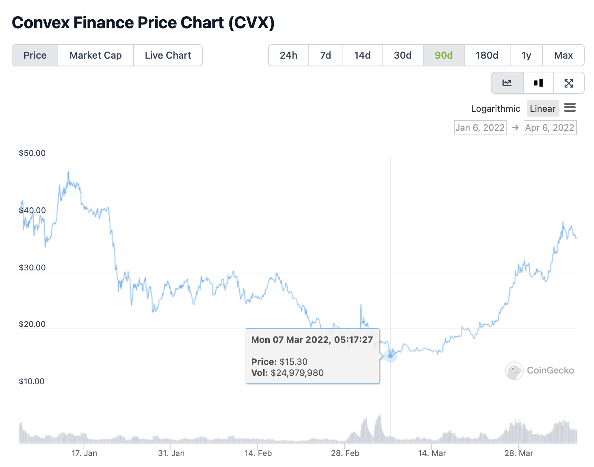
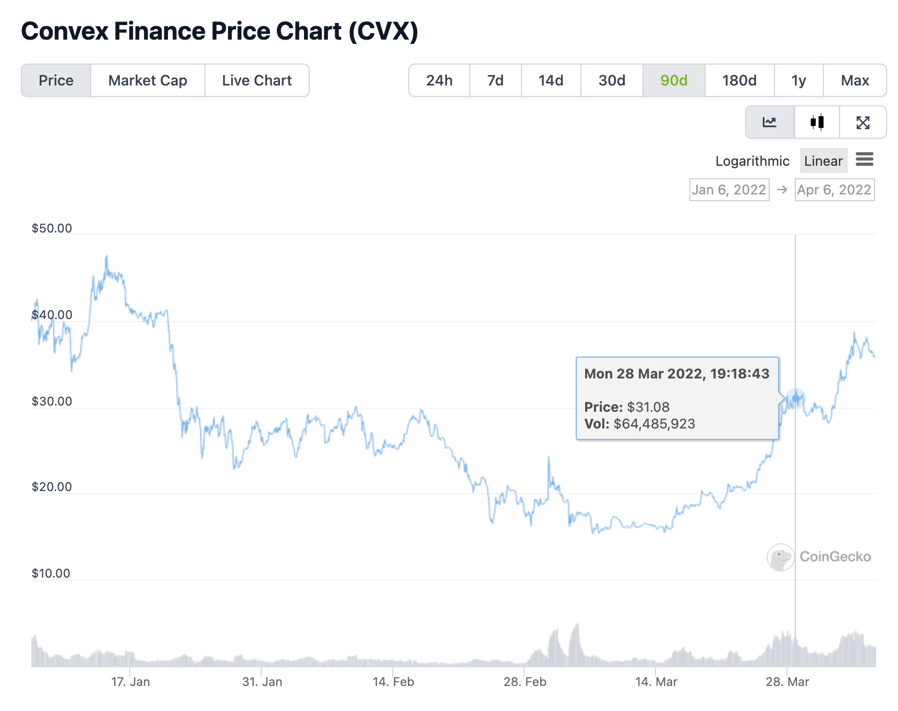
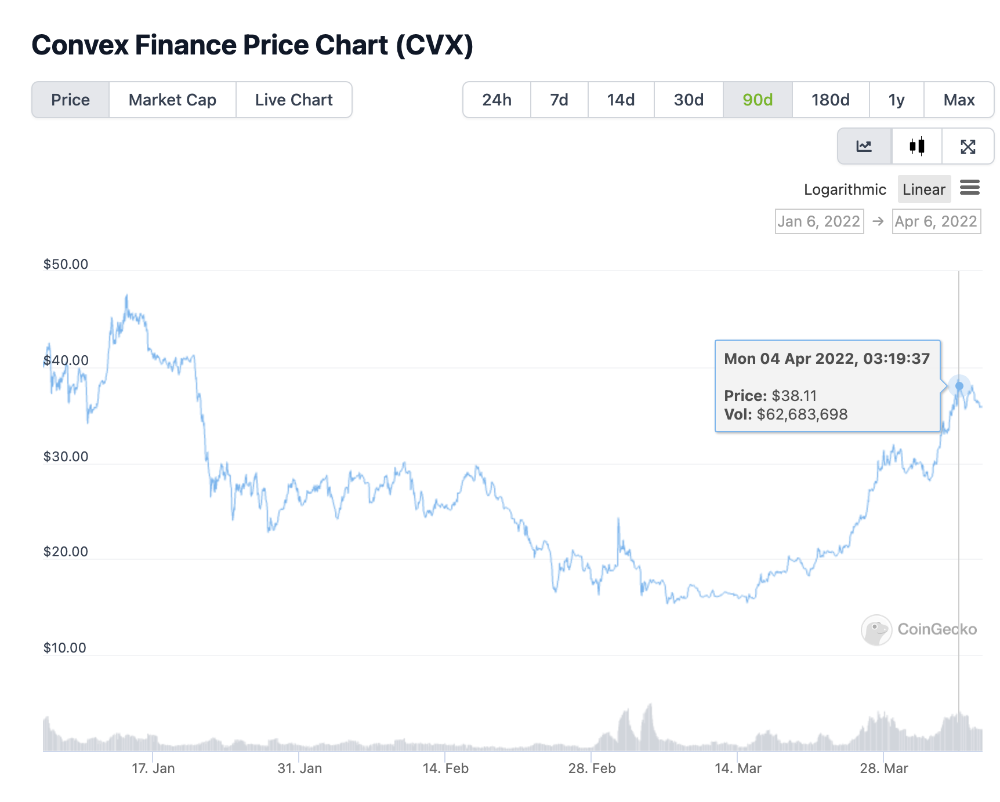

## Simple Summary

As an addendum to TDP 36 ([DTOP Liquidation](https://forum.mstable.org/t/tdp-36-dtop-liquidation/831)) it is proposed to reconsider the swap part of the proposal as CVX token price substantially increased (more than doubled) in the last three weeks and the DTOP position liquidation turned out to be paid in a mix of synthetics productive (sETH, sBTC) and non-productive (sUSD) assets.

It is proposed to swap the sBTC portion of this asset into an equal amount of sBTC and sETH, and use the remaining sUSD portion to purchase CVX as originally ratified. 

The resulting sBTC are to be swapped into WBTC and put into the [50/50 WBTC/WETH pool](https://app.balancer.fi/#/pool/0xa6f548df93de924d73be7d25dc02554c6bd66db500020000000000000000000e) on Balancer to generate BAL rewards that are to be compounded in perpetuity into the existing 80/20 BAL/WETH position on either Balancer or Aura Finance, while the sETH are to be swapped into WETH and be subsequently put into the new [icETH](https://indexcoop.com/blog/introducing-the-interest-compounding-eth-index) product from Index Coop.

## Abstract

On the 28 of March 2022, following [TDP 36](https://mips.mstable.org/TDP/tdp-36.html), the Asset Management subDAO [liquidated](https://etherscan.io/tx/0x37ece7724a78db7721458bab422bc31c1e2c0cafda1668fe55c672f5020ad55c) its DTOP position composed of 180,210 DTOP and obtained in return the following tokens:

- 1.2481 sBTC ($56,509)
- 6.3214 sETH ($21,211)
- 71,497.5762 sUSD ($71,388)

DTOP Liquidation RFC was originally published on the 7th of March 2022. At that time Convex token (CVX) price was $15.30. When the DTOP liquidation was executed, CVX token had gone up to $31.08 i.e an increase in the price of **+203%** compared to the first publication**.** At the time of writing, CVX token is $38.11 which represents a **+249%** increase compared to the original publication date

Please find below data from [Coingecko](https://www.coingecko.com/en/coins/convex-finance) highlighting these specific moments in time.

While CVX potential upside can be substantial in the short term (CVX is still 40.4% down from its ATH), it is proposed to keep the synthetic productive assets obtained from the DTOP liquidation (sBTC & sETH) in the Asset Management SubDAO while still swapping the 71,497 sUSD into CVX.

In line with this discussion, it is therefore proposed to swap the sPositions as follows: 

The resulting sBTC are to be swapped into WBTC and put into the [50/50 WBTC/WETH pool](https://app.balancer.fi/#/pool/0xa6f548df93de924d73be7d25dc02554c6bd66db500020000000000000000000e) on Balancer, while the sETH are to be swapped into WETH and be subsequently put into the new [iceth product](https://indexcoop.com/blog/introducing-the-interest-compounding-eth-index) from [Index Coop](https://indexcoop.com/).

## Motivation

1. The Asset Management subDAO will still take a $71,497 position of CVX and get the benefits described in TDP 36 as well as potentially staking it
2. Total current market value of these highly productive assets is $77,720 representing only **2.089%** of the AssetManagement Sub DAO holdings
3. Create exposition to the best risk/return assets (ETH, BTC) the Asset Management SubDAO Treasury could get over an extended timeframe

## Specification

The Asset Management subDAO will perform the CVX purchase with 71,497 sUSD opportunistically & notify Meta Governors at the completion

The price range targeted will be an +30-70% increase from the original RFC publication price which gives a wide $**19.89-26.01$** price range

- If CVX enters the aforementioned range, it should be immediately bought
- If CVX never reaches the aforementioned range, it should be bought regardless at spot price at the latest **1 month** after the vote of this proposal

The Asset Management subDAO will then proceed to swap sBTC to the amount of generating a proportional basket of 50% sBTC and sETH from the previously performed DTOP liquidation, and then proceed to swap the sBTC portion to WBTC and enter the 50/50 WBTC/WETH pool on Balancer as well as use the sETH portion of the liquidation to swap to WETH and subsequently enter the icETH product as described above.

## Copyright

Copyright and related rights waived via [CC0](https://creativecommons.org/publicdomain/zero/1.0/).